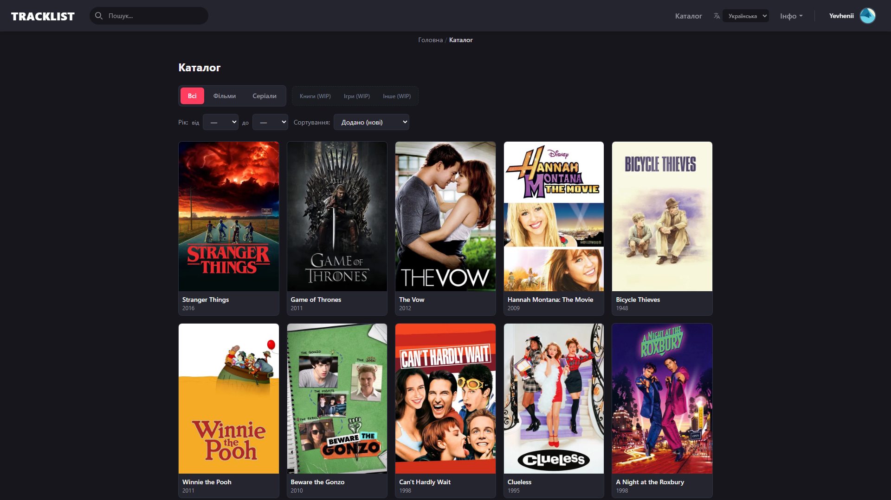
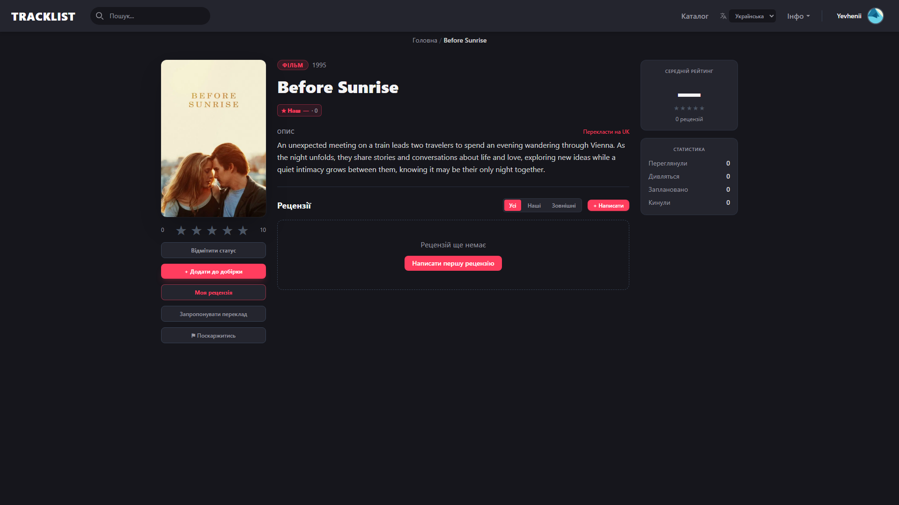
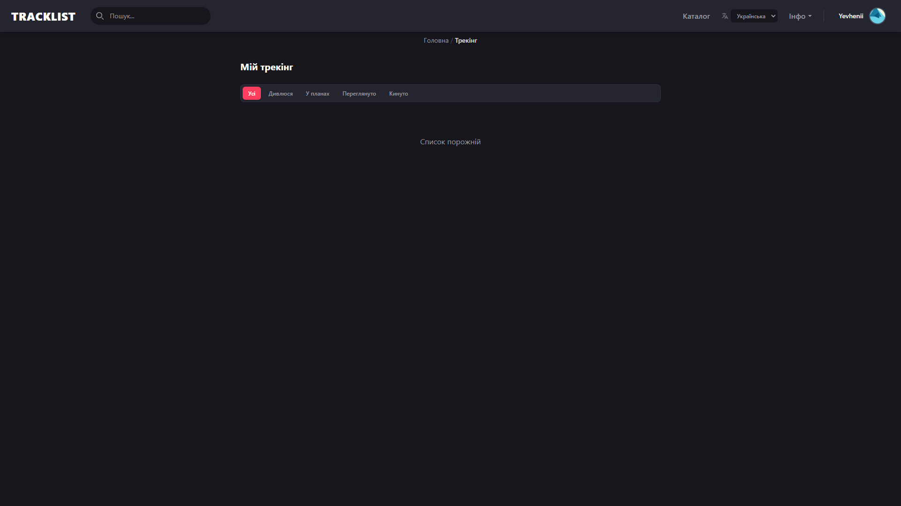
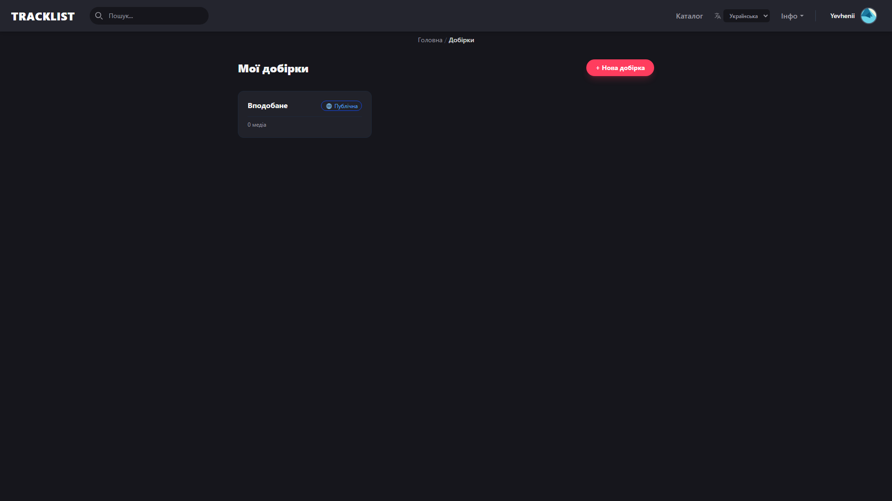
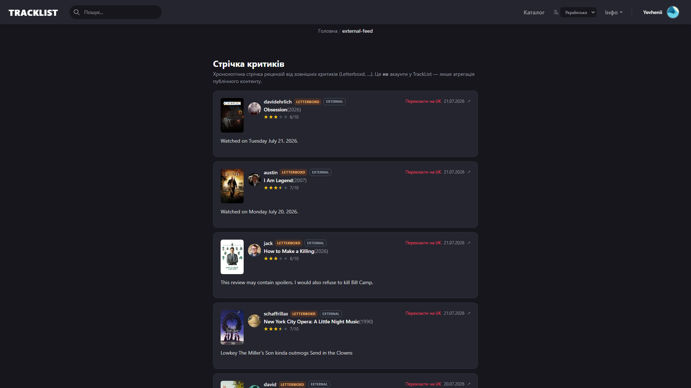
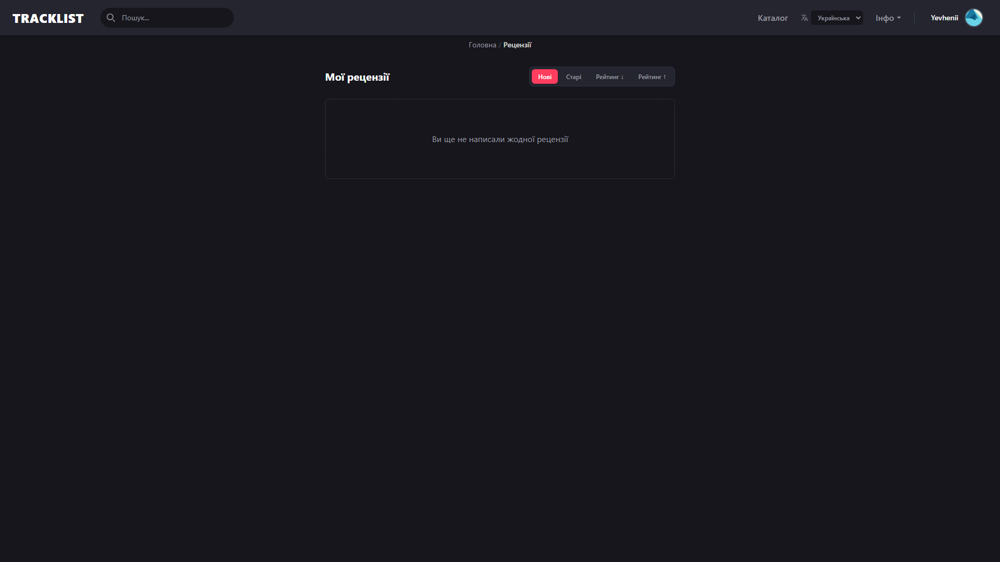
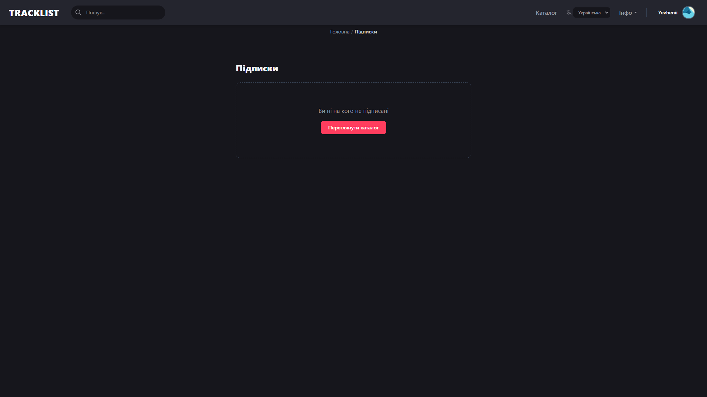
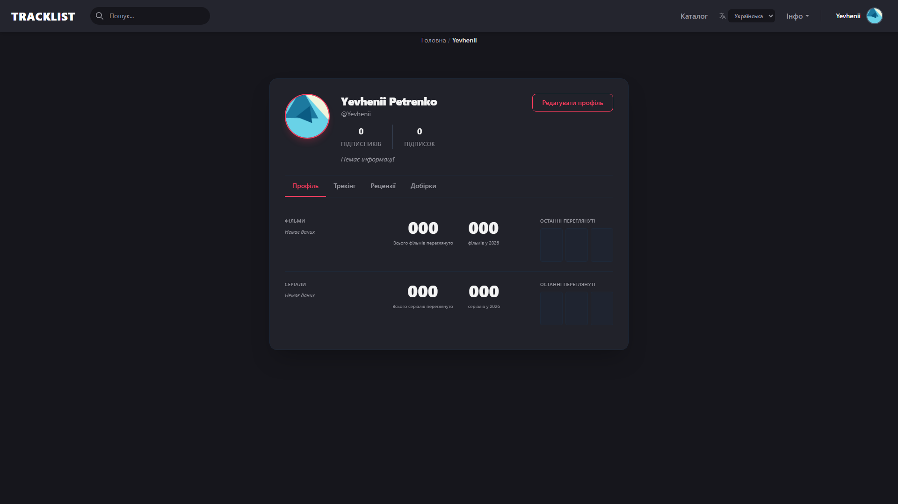

<div align="center">
  <h1>TrackList</h1>
  <p><b>Multimedia Experience Management System</b></p>

  <!-- Badges -->
  
  
  
  
  
</div>

<br />

## 📸 Feature Gallery

#### 🔍 Discovery & Content
<div align="center">
  
  <br />
  
</div>

#### 📚 Tracking & Organization
<div align="center">
  
  <br />
  
</div>

#### 🌐 Social & Feed
<div align="center">
  
  <br />
  
</div>

#### 👤 User Profile & Settings
<div align="center">
  
  <br />
  
  <br />
  
</div>

## 📋 About The Project

**TrackList** is a comprehensive web service designed to manage user experiences and interactions with various multimedia content.

Today, users face the problem of decentralization—using different services to track movies, games, or books. Our goal is to provide a single, centralized platform that allows you to efficiently organize, track, and share your experiences within one universal solution.

## 🚀 Key Features

- **Centralized Tracking:** Create and manage lists ("Watched", "Planned", "Dropped") for all types of media.
- **Progress Tracking:** Keep track of watched episodes, read pages, or playtime.
- **Social Features:** Write reviews, rate content, and view other users' profiles.
- **Statistics & Analytics:** Visualize your content consumption with charts and graphs.
- **Administration:** Built-in tools for content moderation and database management.

## 🛠️ Tech Stack

- **Frontend:** SvelteKit 2, Svelte 5, TypeScript, Tailwind CSS 4
- **Backend:** C#, ASP.NET Core 10, Entity Framework Core
- **Database:** PostgreSQL
- **Testing:** Vitest, .http, XUnit, Cucumber / Reqnroll (BDD)
- **Security:** HTTPS, Password Hashing, JWT Tokens, Server Firewall (UFW)
- **Infrastructure:** Docker, Docker Compose, Nginx

## 📂 Project Structure

```text
TrackList/
├── Source/
│   ├── frontend/            # SvelteKit frontend application
│   ├── Backend/             # ASP.NET Core API backend
│   ├── Features/            # Shared BDD feature files (Gherkin)
│   └── docker-compose.yml   # Docker composition for easy deployment
├── Docs/                    # Project documentation, feature specs, test plans
└── README.md
```

## 💻 Getting Started

### Prerequisites
- [Docker & Docker Compose](https://www.docker.com/) (Recommended for easy setup)
- [Node.js](https://nodejs.org/) (For manual frontend development)
- [.NET SDK 10](https://dotnet.microsoft.com/) (For manual backend development)

### Quick Start with Docker (Recommended)
You can quickly spin up the entire application (Database + Backend + Frontend) using Docker Compose:

```bash
cd Source
docker compose -f docker-compose.dev.yaml up --build
```

### Manual Development Setup

**1. Frontend:**
```bash
cd Source/frontend
npm install
npm run dev
```

**2. Backend:**
```bash
cd Source/Backend/track-list-api
dotnet run
```

*(Note: When developing manually, make sure to set up your `.env` files appropriately and provide a running PostgreSQL database instance).*

## 👥 Contributors

This project was developed by:
- **A.G. Astafiev** — *Team Lead / DevOps*
- **Y.O. Petrenko** — *Frontend*
- **O.S. Pylypchuk** — *Backend*

---
*Kharkiv – 2025*
